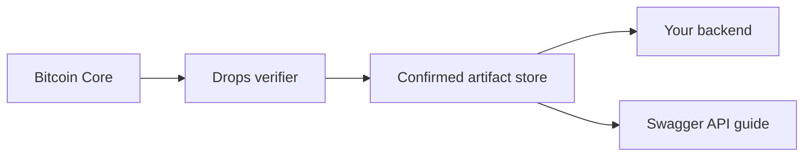

# Run your Drops verifier and API

Run a verifier you control to inspect confirmed Drops with your own Bitcoin Core connection. The service exposes clear read endpoints for your app, explorer, or internal audit tools.



## Prerequisites

- Node.js 20 or later
- A Bitcoin Core node for the target network
- `txindex=1` enabled in Bitcoin Core
- RPC credentials for that node

The indexer reads confirmed blocks, then fetches each candidate input's spent transaction to retrieve the P2TR scriptPubKey. That previous output is required for BIP341 commitment verification. A pruned node or a node without transaction indexing may not be able to serve the required historical transaction.

## Start

```powershell
git clone https://github.com/bitcoinuniverse/drops
cd drops
npm install

$env:BITCOIN_RPC_URL = 'http://127.0.0.1:8332'
$env:BITCOIN_RPC_USER = 'bitcoinrpc'
$env:BITCOIN_RPC_PASSWORD = 'replace-this'

npm run dev -- index update --network mainnet --start-height 0
npm run dev -- serve --network mainnet --start-height 0 --port 3939
```

The API listens on `127.0.0.1:3939` by default. When exposing it beyond your machine, place it behind TLS, authentication, rate limits, request limits, observability, backups, and a reverse proxy that matches your environment.

## Configure InScribe

Set the InScribe backend environment variable:

```text
DROPS_BASE_URL=http://127.0.0.1:3939
```

The generic Drops UI uses the following API:

```text
GET /health
GET /openapi.json
GET /docs
GET /drops/status
GET /drops?limit=50
GET /drops/:id
GET /drops/:id/content
```

`/openapi.json` is the OpenAPI 3.1 contract for the public read endpoints.
Open `/docs` in a browser for Swagger UI. The document describes confirmed
record reads and Pacts Seed discovery only. It does not expose wallet signing,
operator controls, or a claim that a recorded Pact is live execution.

## Operational notes

- State is stored at `.drops/index.json` by default. Place this file on persistent storage.
- The indexer records each processed block hash. On the next run it compares those hashes with Core, rolls back the divergent heights, and rescans the new branch.
- The Drops verifier accepts confirmed blocks only. Mempool sightings are not canonical records.
- Run independent verifiers if your application depends on stronger availability or independent audit.
- Treat arbitrary body MIME as untrusted. Public hosts should use `X-Content-Type-Options: nosniff`, download disposition by default, and an allowlisted preview policy. Do not proxy active HTML, SVG, JavaScript, or other executable content through a trusted origin.
