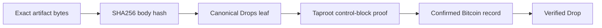

# Why Drops is designed differently

Drops chooses a narrow set of rules to make Bitcoin artifacts easier to interpret consistently across indexers.

## An artifact that stays tied to Bitcoin

Once a Drop is confirmed, its on-chain commitment is immutable Bitcoin history. The artifact is not a profile that an application can quietly edit, and its proof is not a promise from a single database. A verifier recomputes the exact body hash and Taproot commitment from Bitcoin data.

Drops is also BIP-110 ready. The registered `bip110-op-drop` carrier is recognized through its own strict decoder, while the native `drops` carrier keeps its own canonical grammar. This lets wallets and explorers support compatible records without blurring their meaning.

## The core difference

A Drop is not defined by a broad convention plus an indexer's interpretation. It is defined by a fixed Tapscript leaf, a supplied content hash, and a proof that the leaf was committed to the P2TR output that the reveal input spends.

That means an independent verifier can answer four direct questions:

1. Is this exact leaf a registered Drops carrier?
2. Does the body match the committed SHA256 hash?
3. Did the control block commit the leaf to the spent Taproot output?
4. Is the reveal in the confirmed chain currently being indexed?

## What Drops intentionally avoids

- It does not assign an artifact to a satoshi sequence.
- It does not accept alternate push encodings for the same payload.
- It does not allow an unbounded body.
- It does not turn generic artifacts into fungible balances by inference.
- It does not replace its canonical ID with a visual numbering system.

## A better user experience through explicitness

For users, the visible result is simple: the app can show the artifact's stable ID, block confirmation, content hash, creator key, anchor outpoint, and proof status as distinct facts. For builders, the result is a small consensus surface that is easy to test and difficult to reinterpret accidentally.

Ordinal inscription conventions remain useful for applications that want satoshi-level assignment and their surrounding ecosystem. Drops is aimed at a different tradeoff: explicit, compact, independently verifiable artifacts.
