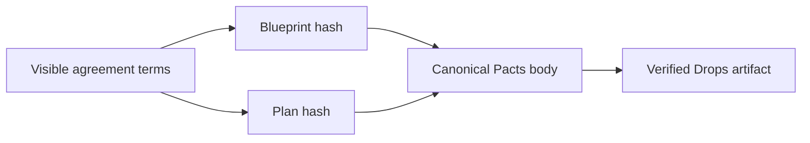

# Pacts Studio artifact record

Pacts Studio records a completed blueprint and plan hash pair as a compact Drops artifact. It is the portable Bitcoin record for an agreement people have already reviewed.



## What this gives you

The artifact keeps a small, exact record of the completed agreement on Bitcoin. It lets each party:

- Compare the blueprint and plan hashes they saved with the confirmed artifact.
- Find the exact confirmed Drop associated with a completed agreement.
- Share one compact record without exposing private keys or signing material.
- Verify that the body, its hash, the Taproot commitment, and the Bitcoin confirmation all agree.

Pacts Studio produces a deterministic blueprint and a readable PactScript. After all visible template checks pass, it exports the small artifact that a wallet can place inside a normal Drops envelope. The record gives every party the same compact, hash-addressed view of the completed terms.

## Carrier

The enclosing artifact must be a valid Drops or registered `bip110-op-drop` carrier with this canonical MIME type:

```text
application/vnd.drops.pacts-reference+json
```

The standard Drops rules still apply: one canonical leaf, minimal pushes, SHA256 body commitment, 256-byte maximum body, a valid x-only public key, and a proven BIP341 control-block commitment to the spent P2TR output.

## Canonical artifact body

The body is UTF-8 JSON with exactly four keys in this exact order:

```json
{"bh":"<64 lowercase hex characters>","p":"pacts","ph":"<64 lowercase hex characters>","t":"fair-launch"}
```

| Key | Meaning | Rule |
| --- | --- | --- |
| `bh` | `blueprintHash` | 32-byte SHA256, lowercase hexadecimal. |
| `p` | Protocol selector | Exactly `pacts`. |
| `ph` | `planHash` | 32-byte SHA256, lowercase hexadecimal. |
| `t` | Template ID | Lowercase bounded Pacts template ID, letters, digits, and hyphens. |

Whitespace, reordered keys, extra keys, escaped alternatives, uppercase hashes, and semantically equivalent JSON are invalid for this profile. The parser reconstructs the canonical body from parsed values and requires byte-for-byte equality before exposing it as a `pactsReference`.

## Hash definitions

`blueprintHash` and `planHash` come from the Pacts Studio plan:

- `blueprintHash` is the SHA256 digest of the deterministic `pacts-studio-blueprint` object.
- `planHash` is the SHA256 digest of the deterministic Studio plan commitment, including the blueprint, the blueprint hash, PactScript, and the optional canonical op-drop deploy JSON.

The artifact body has its own SHA256 body hash inside the enclosing Drops leaf. That outer hash proves the exact bytes of the completed hash pair.

## Find a recorded agreement

An indexer records the structured `pactsReference` field only after the enclosing Drops proof and the strict artifact parser both succeed.

Search uses the exact plan hash:

```text
GET /drops?planHash=<64 lowercase hex characters>
```

The result lists confirmed Drops whose parsed `pactsReference.planHash` exactly matches the query.

## Record an artifact with the Drops CLI

```powershell
node dist/cli.js pacts reference `
  --plan-hash <plan-hash> `
  --blueprint-hash <blueprint-hash> `
  --template fair-launch

node dist/cli.js pacts compile `
  --plan-hash <plan-hash> `
  --blueprint-hash <blueprint-hash> `
  --template fair-launch `
  --pubkey <x-only-public-key>
```

`pacts compile` returns an unsigned Drops leaf. A Taproot-capable wallet constructs, funds, signs, reviews, and broadcasts the commit and reveal transactions. The Drops CLI never accepts private keys or signing material.
